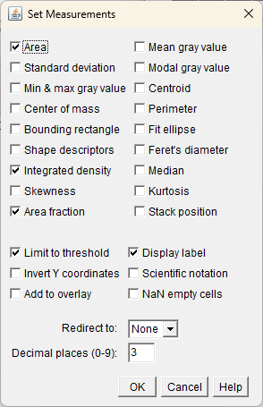
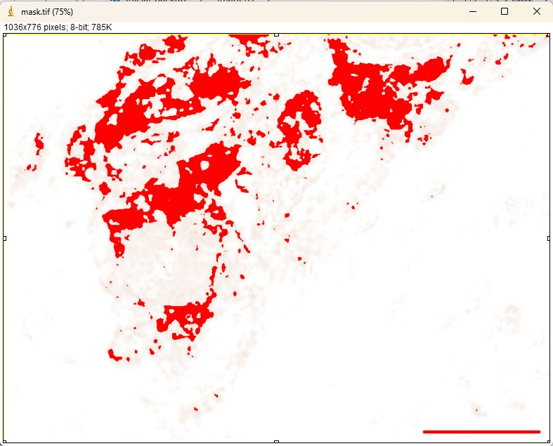
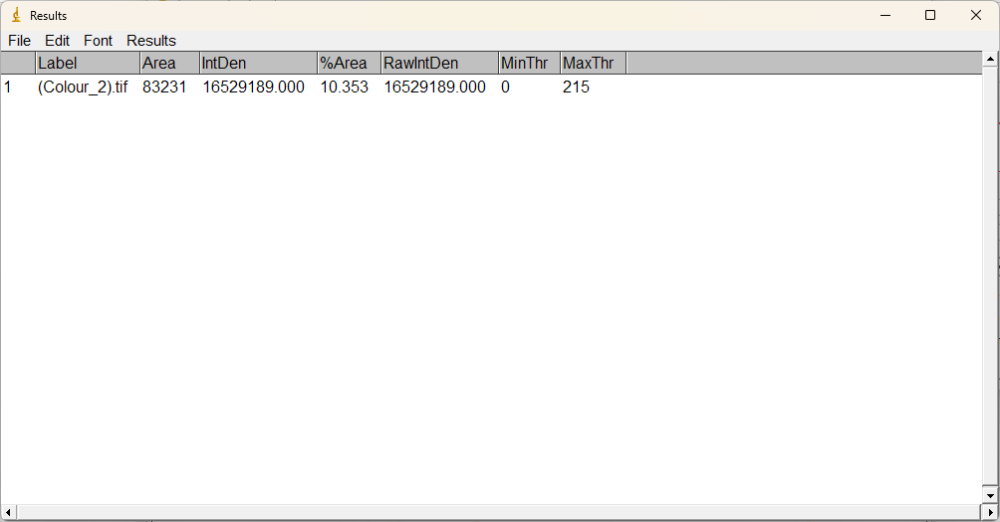
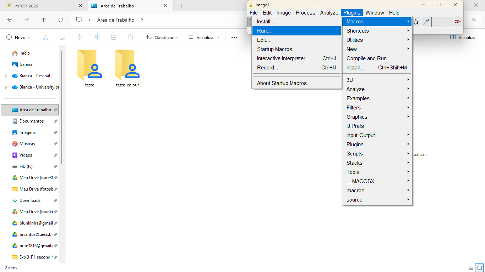
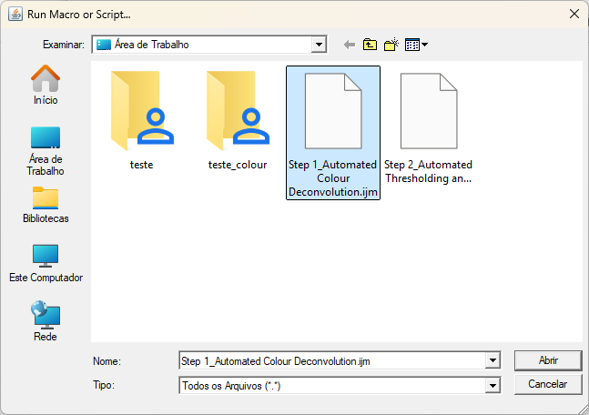
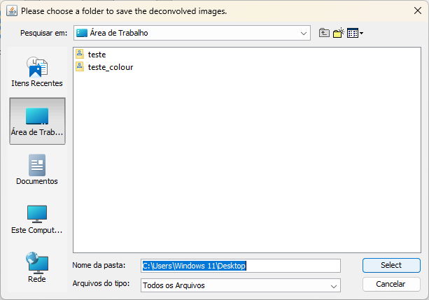
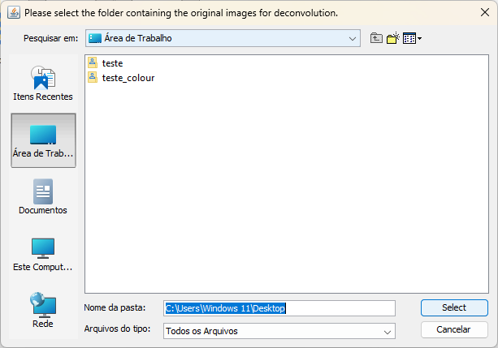
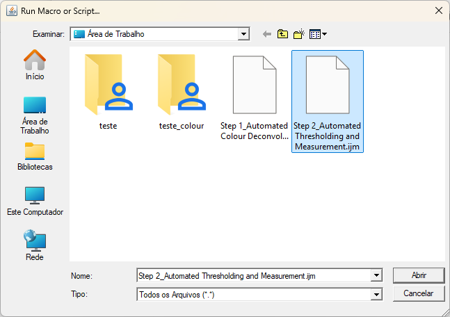
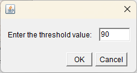
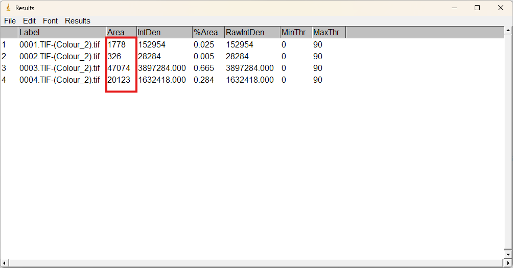

# ImageJ Scripts for IHC: Stained Area Quantification
Automated ImageJ/Fiji scripts for IHC (H; DAB) quantification: colour deconvolution, thresholding, and area measurement.

## Description
This repository contains two scripts designed to automate the quantification of DAB-stained areas:

1. **Step 1: Automated Colour Deconvolution**
     - This macro performs automated colour deconvolution across an entire image set. Specifically, it extracts and saves the DAB layer from each image (labeled as 'Colour_2') into a user-specified output directory. The macro first prompts the user to select the destination folder for the deconvolved images, followed by the selection of the folder containing the original image files.
       
   ⚠️IMPORTANT:
   
   -  You can ignore any warning messages that appear when the process finishes.

   - Please check the output directory to confirm all images were successfully deconvolved and saved.  

   - If you are using the Colour Deconvolution plugin instead of Colour Deconvolution2, change the function name in the following line:

                       run("Colour Deconvolution2", "vectors=[" + deconvolution_preset + "] output=8bit_Transmittance simulated cross hide");

3. **Step 2: Automated Thresholding and Measurement**
     - This macro performs automated thresholding and subsequent measurement across an entire image set. It allows the user to select images from a specified input folder (e.g., the folder containing deconvolved images). The macro then applies a user-selected threshold and performs measurements on all images. Finally, a results window will open, displaying all collected measurements. Before running the macro, ensure your desired measurement settings in ImageJ are pre-configured, specifically, if the 'Display label' option is selected, to label the analyzed images in the results table.

## 💡How to Use
1. Open ImageJ or Fiji.
2. Plugins > Macros > Run.
3. Select **Step 1**.
4. Once finished, run **Step 2** on the output folder generated by Step 1.
 
 ⚠️IMPORTANT:
   -  Always check that the macro is running properly, and before running it.
   -  Make sure the **Set Measurements** parameters are correctly configured. Recommendation:

       Go to Analyze > Set Measurements... and ensure that Area, Area Fraction, Limit to Threshold, and Display Label are checked.
    
   | **Example of the Set Measurements Settings** | 
   | :---: |
   |  | 

## ✅Requirements
- [ImageJ](https://imagej.nih.gov/ij/) or [Fiji](https://fiji.sc/)
- Colour Deconvolution (Built-in in Fiji) or [Colour Deconvolution 2](https://github.com/fiji/Colour_Deconvolution) (see line 10).

## Here is an example of the processing performed by the scripts:

| **Original (H-DAB)** | **Step 1 - DAB Layer** | **Step 2 - Threshold Mask**|  **Step 2 - Measurements**|
| :---: | :---: | :---: | :---: |
|  | .png) |  | |

## Here is a step-by-step example of how the script works:
*Step 1_Automated Colour Deconvolution* 
| **1 – Run Macro** | **2 – Choose the macro file** | **3 – Choose a folder to save the deconvolved images** | **4 – Select the folder containing the original images for deconvolution** |
| :---: | :---: | :---: | :---: |
|  |  |  | |

*Step 2_Automated Thresholding and Measurement* 
| **1 – Run Macro** | **2 – Choose the macro file** | **3 – Enter the threshold value** | **4 – Choose the folder containing the images for thresholding** | **5 – Obtain the results from the *Measurements* table** |
| :---: | :---: | :---: | :---: |:---: |
|  |  |  | | |

## 📥 Download Scripts
You can download the scripts directly by clicking the links below:

* [Download Step 1: Automated Colour Deconvolution](Macros/Step%201_Automated_Colour_Deconvolution.ijm)
* [Download Step 2: Automated Thresholding and Measurement](Macros/Step%202_Automated_Thresholding_and_Measurement.ijm)

> **Tip:** To download, right-click the link and select "Save link as...".

